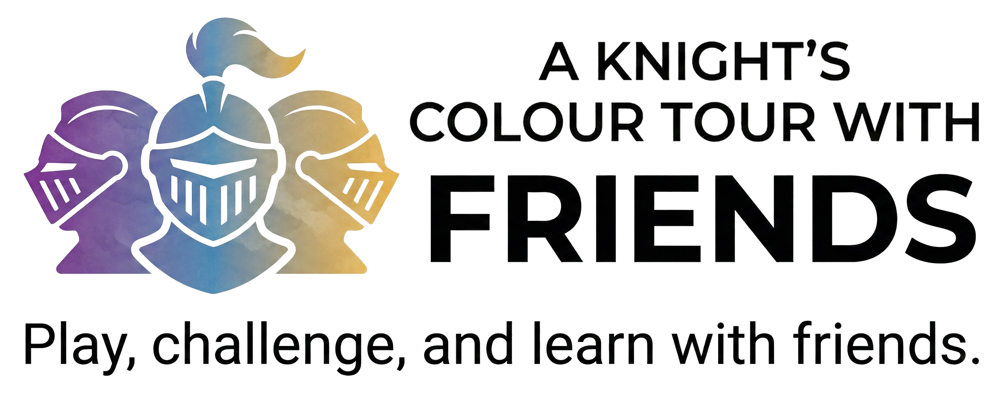

# A Knight's Colour Tour With Friends ♞
> **A modern, colourful twist on a 1,000-year-old math problem.**

**A Knight's Colour Tour With Friends** is an open-source, grid-based logic puzzle. By combining the classic movement of a chess Knight with colour based region constraints, this platform offers a transparent, serverless environment for puzzle enthusiasts to test their spatial reasoning, build their own unique challenges, and share them with friends and colleagues instantly.

---

### 🚀 Navigation
* [🏁 Quick Start](#-quick-start-i-just-want-to-play)
* [🎮 The Rules](#-the-rules)
* [🛠️ Customizing (Build Tab)](#️-the-build-tab-customize-your-challenge)
* [✉️ Sharing Challenges](#️-sharing-challenges)
* [💡 The Solve Tab](#-the-solve-tab-watch-and-learn)
* [🛠️ Technical Info](#️-technical-implementation)

---

### ⚠️ Early Release Notice
This is the **first public release** of the Knight's Colour Tour engine. While it has been tested, you may find a few edge-case bugs.

**Found a bug or have a suggestion?** I'd love to hear from you! Please connect with me and send a message on **[LinkedIn](https://www.linkedin.com/in/rilhia/)**. Your feedback helps make this better for everyone!

---

## 🏁 Quick Start: I Just Want to Play!
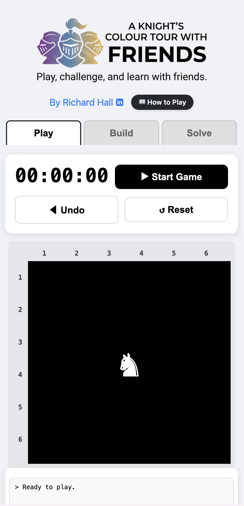

When you first load the game, a procedurally generated puzzle is already waiting for you on the **Play** tab.

1.  **Start the Game:** Press the "▶ Start Game" button. A 3-2-1 countdown will begin.
2.  **Moving the Knight:** Tap any valid cell that is an "L" shape away from your current position (the ♞ marker). 
3.  **Tracking Progress:** The game automatically shades in regions you have already visited and logs your moves in the activity box.
4.  **Making a Mistake:** If you trap yourself, simply press **◀ Undo** to walk back through your move history.
5.  **Winning:** The game completes when you successfully visit every color on the board exactly once!

> ⚠️ **Important:** If you leave the **Play** tab during an active game, the board will reset. Finish your tour before switching tabs!

---

## 🎮 The Rules
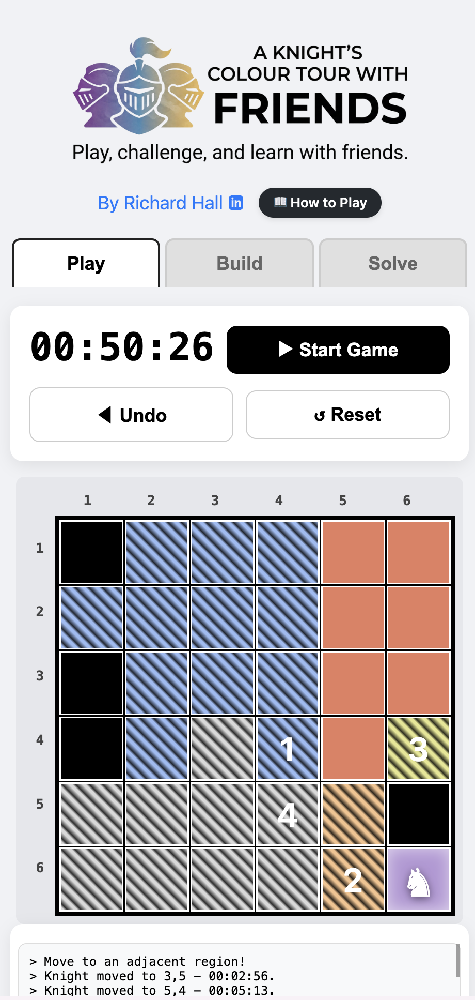

Your goal is to complete a modified Knight's Tour. You must satisfy three simple constraints:

1.  **Movement:** You can *only* move in a standard chess Knight pattern (two squares in one direction, and one square perpendicular).
2.  **Regions:** You must land on every color-coded region exactly **once**. 
3.  **No Backtracking:** You cannot jump into a colored region that you have already visited, and you cannot land on black "Void" spaces.

---

## 🛠️ The Build Tab: Customize Your Challenge
The **Build** tab is a fully-featured level editor. It allows you to generate random puzzles, manually plot paths, or paint your own custom grids using a seamless drag-to-paint touch interface.

### 1. Automatic Design (Procedural Generation)
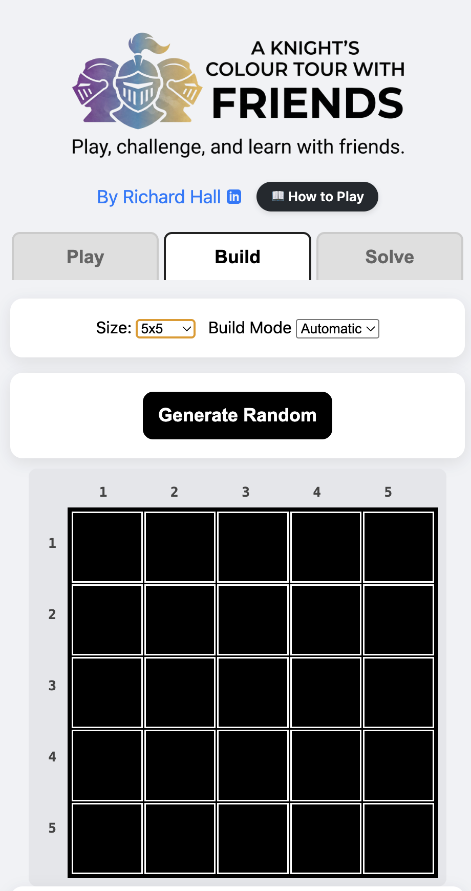

* Switch **Build Mode** to **Automatic**.
* Select your **Size** (5x5 to 10x10).
* Click **Generate Random**. The engine will mathematically guarantee a board with exactly *one* valid solution.

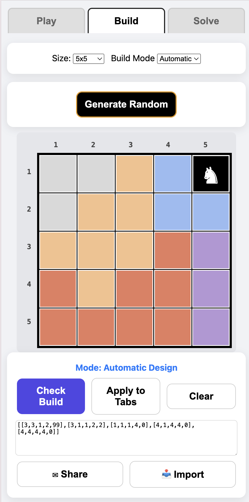

* Click **Apply to Tabs** to send it to the Play and Solve environments.

### 2. Manual Design (Plotting a Path)

* Switch **Build Mode** to **Manual**.
* **Stage 1:** Click squares in sequence to manually draw a hidden Knight's path.

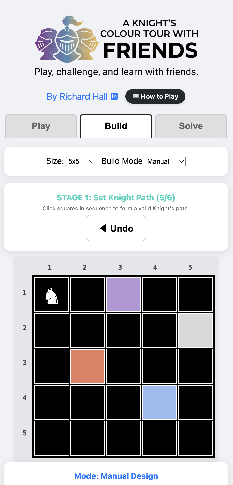
  
* **Stage 2:** Click **Check Build**. The engine will verify if your path is mathematically sound.

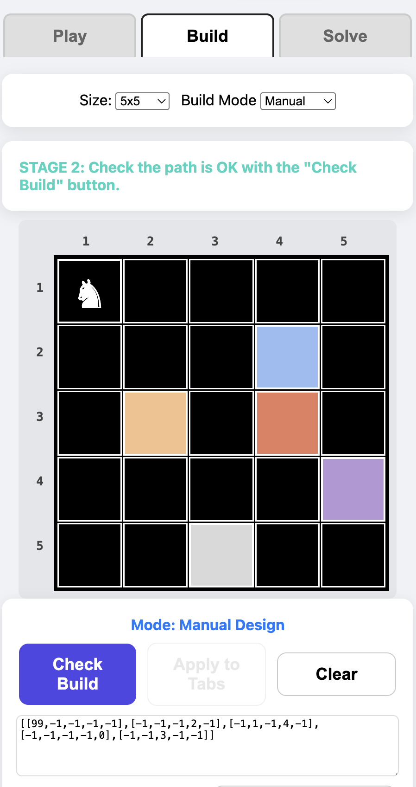

* **Stage 3:** Colour the rest of the board to hide your path.

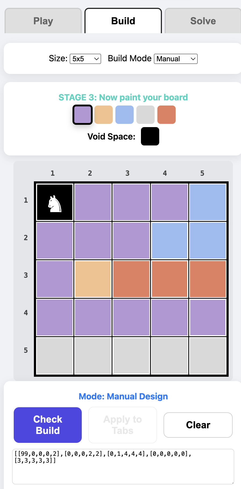

* *Note:* If your path allows for multiple different solutions, the UI will highlight "Ghost Paths" (red boxes) showing where the logic breaks. Change the colours of these squares or set them to void (black).

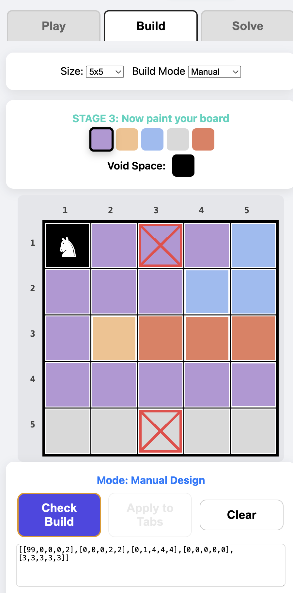

This can be an iterative process of changing and clicking on the **Check Build** button.

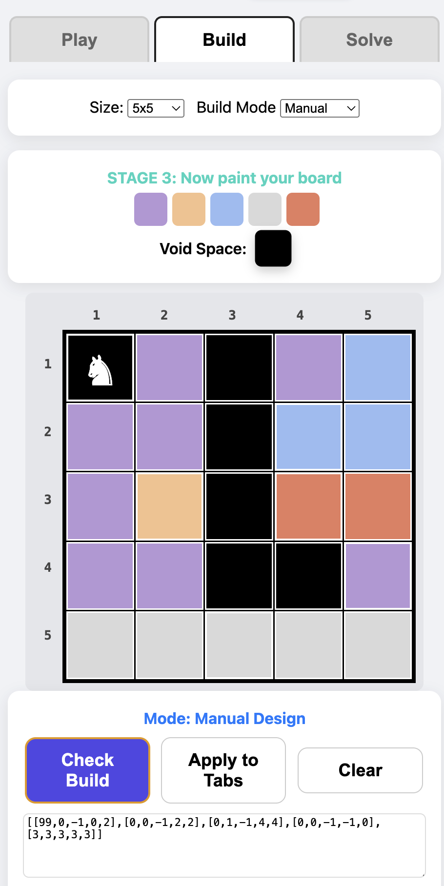

* **Success:** Once you get the "Success: Unique solution verified!" message, you can click on the **Apply To Tabs** button and play.

### 3. Edit Mode (Painting)
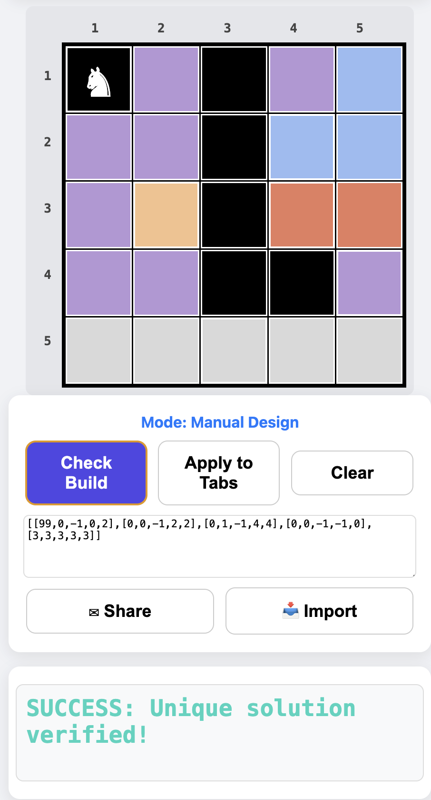

* Switch the dropdown to **Edit**.
* Select a colour from the dynamic palette (or select the Black "Void" space).
* Tap or **drag your finger/mouse** across the grid to paint custom regions. 
* Click **Check Build** to ensure your custom paint job still only yields one unique solution.
* * *Note:* Like in the **Manual** mode, this can be an iterative process.

---

## ✉️ Sharing Challenges
Once you have a verified board, challenge your friends instantly—no accounts or databases required:

* **The Share Button:** On mobile, this opens your native sharing sheet. On desktop, it copies a unique URL to your clipboard. The link contains the *entire* board state encoded right into the web address!
* **Manual Text Import:** Copy the JSON array block (e.g., `[[0,0...]]`) from the text box and send it to a friend. They can paste it into their own Build tab and click **📥 Import**.

---

## 💡 The Solve Tab: Watch and Learn

Stuck on a puzzle a friend sent you? Let the engine do the heavy lifting.

1.  Ensure the board is loaded.
2.  Navigate to the **Solve** tab and click **▶ Auto Solve**.
3.  Sit back and watch as the algorithmic solver animates the correct Knight's Tour step-by-step, logging every coordinate along the way.

---

## 🛡️ The Mission
This project modernizes classic computational mathematics for the daily-puzzle era:
1.  **P2P Challenges:** Competition happens via direct links. No manipulated leaderboards.
2.  **Creative Freedom:** Architect and validate your own logic puzzles with a touch-friendly UI.
3.  **Zero Friction:** No apps to install, no servers to query, no logins to create.

---

## 🛠️ Technical Implementation
* **Zero-Server P2P State:** Board layouts are stored entirely in **Base64 URL Encoding** using the Web Share API.
* **Algorithmic Validation:** Features a recursive backtracking engine that probes the grid for multi-solution conflicts (`findAllSolutions`).
* **Unified Pointer API:** Uses native `elementFromPoint` and pointer capture release to allow smooth, lag-free drag-to-paint functionality across both mobile touchscreens and desktop mice.
* **Vanilla Architecture:** 100% Vanilla JS, HTML, and CSS contained in a single file for maximum portability and educational transparency.

**Built by [Richard Hall](https://www.linkedin.com/in/rilhia/)** | **[MIT License](https://opensource.org/licenses/MIT)**
